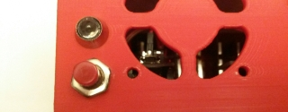

# Shutdown Button and Status LED

When the RotorHazard S32_BPill hardware is used, the standard setup is to have a shutdown button and a status (AUX) LED wired to the PCB. See the [RotorHazard S32_BPill Case Build Guide &#10132;&#xFE0E;](https://github.com/RotorHazard/RotorHazard/tree/main/resources/S32_BPill_case/detailedCaseBuild.md) for details on the wiring. The S32_BPill PCB also supports a buzzer, which provides feedback sounds.

For the shutdown features to operate correctly, the Raspberry Pi needs have its '/boot/config.txt' file configured as [described](Software%20Setup.md#s32btconfig) in the '[doc/Software Setup.md](Software%20Setup.md)' document.

### Shutdown Button

When the RotorHazard server is running, the button, LED and buzzer will operate as follows:

* When the button is pressed, the buzzer will emit a short beep.

* While the button is held, the LED will show a fast-flashing pattern.

* If the button is held for more than 2.5 seconds, a system shutdown is initiated. The buzzer will emit a medium-length beep, and the LED will stop flashing and be steady on. At this point the button can be released. The buzzer will emit a series of short beeps (for several seconds), followed by a long beep, and the LED will turn off. At this point it is safe to power down the timer.

* If a shutdown is initiated via the RotorHazard web GUI, the buzzer and LED feedback will be similar to what is described above.

When the RotorHazard server is not running there will be less LED and buzzer feedback, but the button may still be used to shut down the system (as long as the '/boot/config.txt' file is configured as [described](Software%20Setup.md#s32btconfig)). In this case the button needs to be held in longer (5-10 seconds), until a buzzer beep is emitted and the LED is steady on. After that, the buzzer and LED feedback should be similar to what is described above.

### Status (AUX) LED Patterns

When the Raspberry Pi is detected (by the BPill processor on S32_BPill board) as operating (not shut down), the Status (AUX) LED will be mostly on, and will blink to indicate activity, as follows:

* One blink every two seconds: The Raspberry Pi is operating, but the RotorHazard server is not running (or has not yet started up).

* One blink every two seconds and additional three-blink patterns mixed in: The RotorHazard server is running, and is "idle" (no web-GUI clients have connected).

* Continuous fast blinking: The RotorHazard server is running, and a web-GUI client has connected. This pattern continues until the server (or the system) is shut down (regardless of whether or not web-GUI clients are currently connected).

### Buzzer Beep Patterns

* When the timer is first powered on, the buzzer should always emit two short beeps. A similar pattern is emitted when the RotorHazard server starts up.

* When the first web-GUI client connects to the RotorHazard server, the buzzer will emit one short beep.

* When the shutdown button is pressed, the buzzer will emit a short beep.

* When a system shutdown is in progress, the buzzer will emit a series of short beeps (for several seconds), followed by a long beep. (At this point it is safe to power down the timer.)

### Configuration Parameters

The following parameters may be configured (in 'src/server/config.json') under "GENERAL":

* SHUTDOWN_BUTTON_GPIOPIN : The GPIO pin number on the Raspberry Pi for the shutdown button (defaults to 18)

* SHUTDOWN_BUTTON_DELAYMS : The length of time (in milliseconds) that the button needs to be held to initiate a shutdown (defaults to 2500)

 

-----------------------------

See Also:  
[doc/Software Setup.md](Software%20Setup.md) 
[doc/Hardware Setup.md](Hardware%20Setup.md) 
[doc/User Guide.md](User%20Guide.md)
